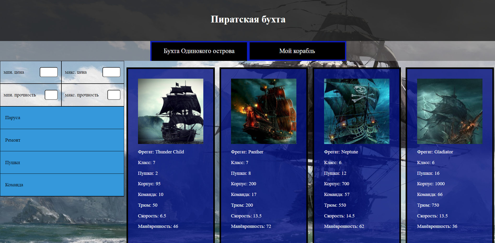
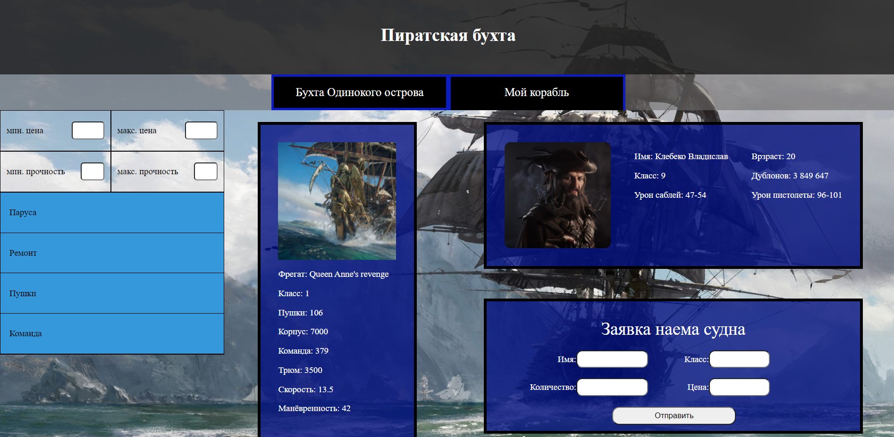
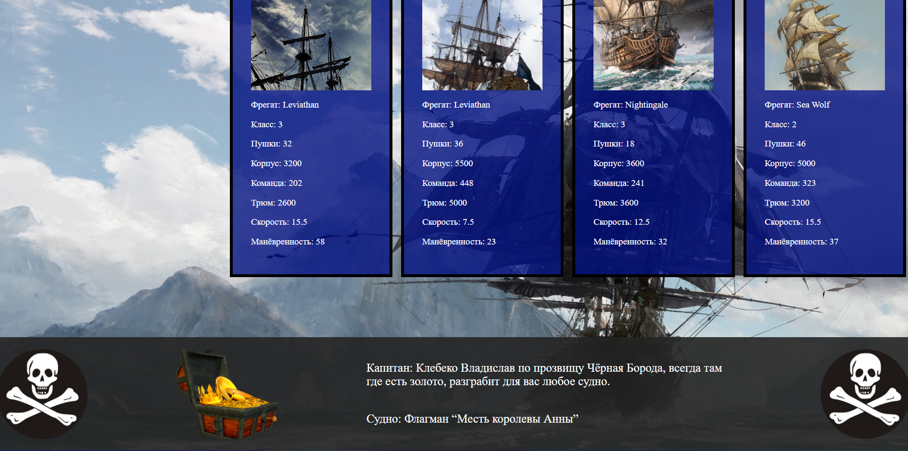

The implementation is in the files index.html, index.js, main.css. I performed the task through debugging. At the moment, everything works except for the full sort.
To start, you just need to open index.html in the tool and open it in the browser there.

