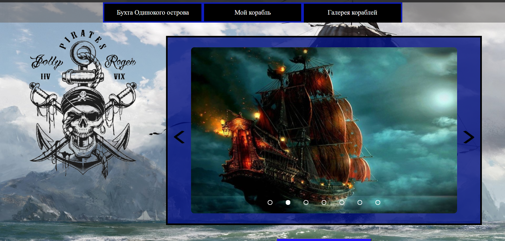

The implementation is in the files index.html, index.js, main.css. I performed the task through debugging.
To start, you just need to open index.html in the tool and open it in the browser there.

I get the weather information from southern Sudan.

